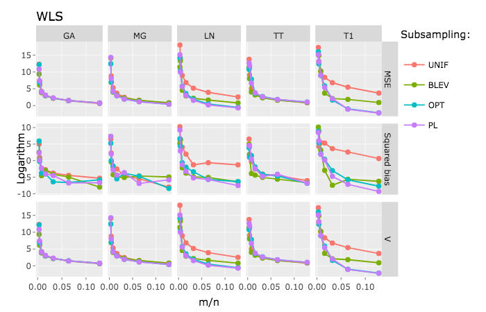

README
================

# optimalSubsampling

This project investigates if and how systematic subsampling can be
applied to imbalanced learning. All details can be found in this
[Jupyter notebook](notebook.ipynb) - good if you want a condensed,
interactive version and like working with Jupyter notebooks. For a
better reading experience I would recommend using the more detailed
[HTML](model_selection.html). A quick overview is provided below.

## Overview

The case for subsampling involves *n* &gt;  &gt; *p*, so very large
values of *n*. In such cases we may be interested in estimating model
coefficients *β̂**m* instead of *β̂**n* where
*p* ≤ *m* &lt;  &lt; *n* with *m* freely chosen by us. In practice we
may want to do this to avoid high computational costs associated with
large *n* as discussed above. The basic algorithm for estimating
*β̂**m* is simple:

1.  Subsample with replacement from the data with some sampling
    probability {*π**i*}.
2.  Estimate least-squares estimator *β̂**m* using the
    subsample.

Here we look at a few of the different subsampling methods investigated
and proposed in Zhu et al, 2015, which differ primarily in their choice
of subsampling probabilities {*π**i*}. The baseline results
from Zhu et al, 2015, are replicated here and consistent with the
authors’ findings: systematic subsampling can greatly improve model
performance.

